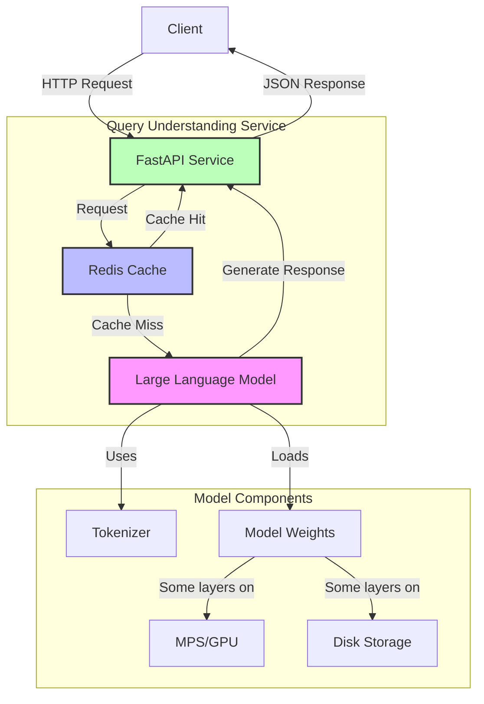
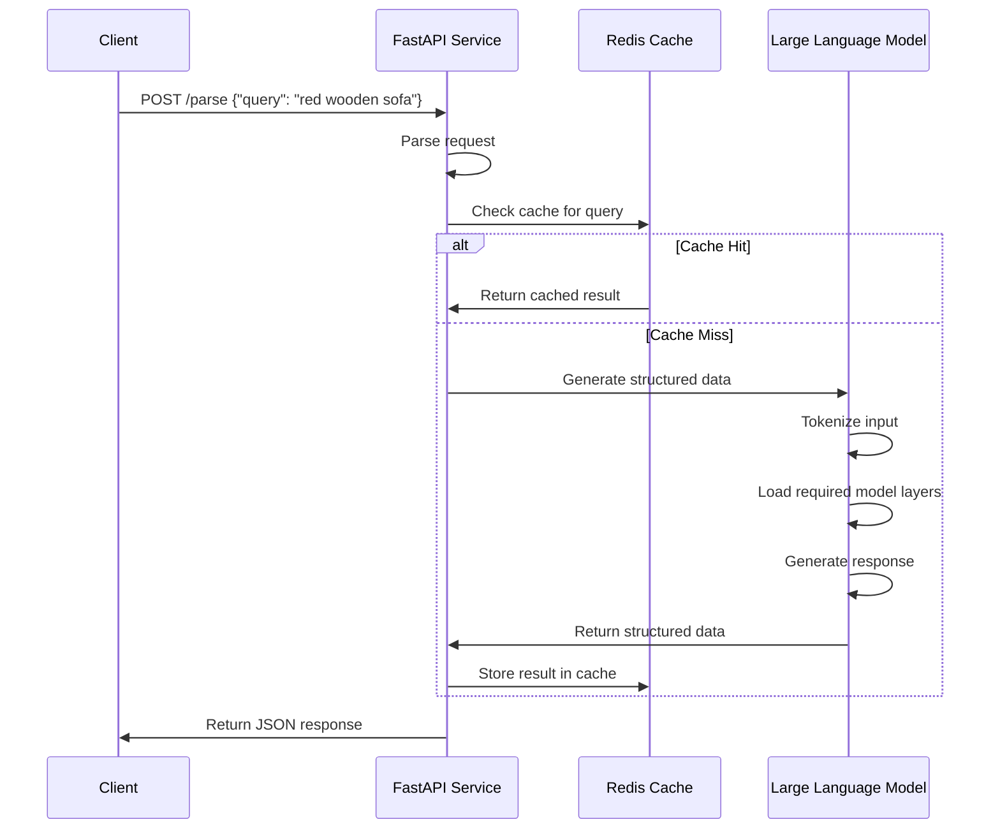
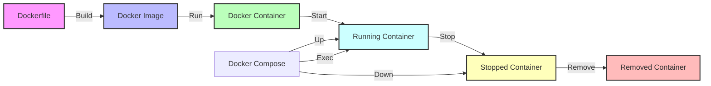
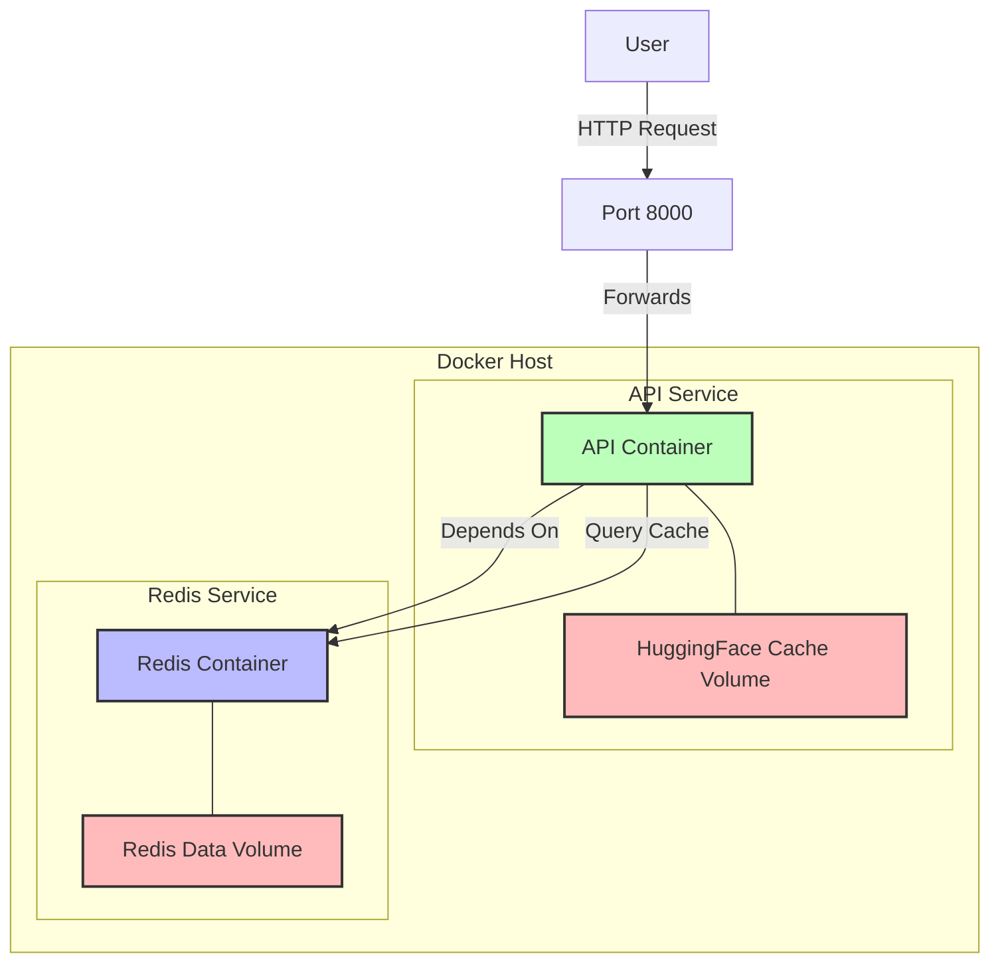
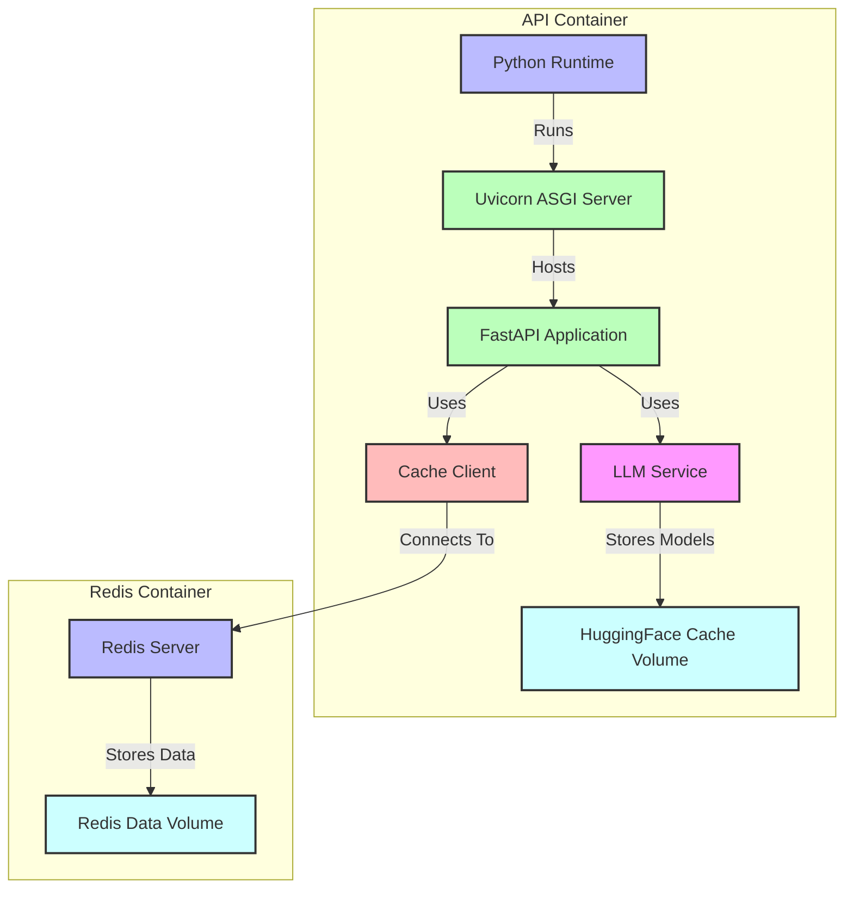

# LLM Query Understanding Service

This project implements a query understanding service powered by Large Language Models (LLMs), following the tutorial at [softwaredoug.com](https://softwaredoug.com/blog/2025/04/08/llm-query-understand).

## Table of Contents

- [Overview](#overview)
- [Key Features](#key-features)
- [Architecture](#architecture)
  - [System Architecture Diagram](#system-architecture-diagram)
  - [Request Processing Flow](#request-processing-flow)
- [Dependencies](#dependencies)
  - [Core Dependencies](#core-dependencies)
  - [Additional Dependencies](#additional-dependencies)
- [FastAPI in Detail](#fastapi-in-detail)
- [Uvicorn in Detail](#uvicorn-in-detail)
- [Local Setup](#local-setup)
  - [Prerequisites](#prerequisites)
  - [Installation](#installation)
  - [Running Locally](#running-locally)
- [Docker Deployment](#docker-deployment)
  - [Prerequisites](#prerequisites-1)
  - [Using Docker Compose](#using-docker-compose)
  - [Managing Docker Compose Containers](#managing-docker-compose-containers)
  - [Building the Docker Image Manually](#building-the-docker-image-manually)
  - [Managing Individual Docker Containers](#managing-individual-docker-containers)
  - [Docker Startup Process](#docker-startup-process)
  - [Docker Troubleshooting](#docker-troubleshooting)
  - [Docker Image Optimization](#docker-image-optimization)
- [Deployment to Kubernetes](#deployment-to-kubernetes)
- [Startup Process](#startup-process)
- [Troubleshooting](#troubleshooting)
  - [Model Offloading Error](#model-offloading-error)
  - [Other Common Issues](#other-common-issues)
- [Debugging and Logging](#debugging-and-logging)
  - [Logging Configuration](#logging-configuration)
  - [Log Categories](#log-categories)
  - [Performance Monitoring](#performance-monitoring)
- [API Usage](#api-usage)
  - [Root Endpoint](#root-endpoint)
  - [Health Check Endpoint](#health-check-endpoint)
  - [API Documentation Endpoints](#api-documentation-endpoints)
  - [Query Understanding Endpoint](#query-understanding-endpoint)
  - [Response Fields](#response-fields)
- [Project Structure](#project-structure)
- [Project Files in Detail](#project-files-in-detail)
  - [Entry Point](#entry-point)
  - [Core Components](#core-components)
  - [Configuration Files](#configuration-files)
- [Performance Considerations](#performance-considerations)

## Overview

This service transforms unstructured search queries into structured data formats, enabling more accurate and useful search results. By leveraging open-source LLMs, the service parses natural language queries into JSON objects with specific fields relevant to the search domain.

## Key Features

- FastAPI-based REST API for query understanding
- Uses open-source LLMs (Qwen2-7B by default) for natural language understanding
- Transforms search queries into structured JSON data
- Docker containerization for easy deployment
- Supports deployment to Kubernetes (GKE)
- Includes caching capabilities using Redis/Valkey

## Architecture

The service consists of a FastAPI application that:
1. Receives search queries via a REST API endpoint
2. Processes the query using a locally-hosted LLM
3. Returns structured JSON data representing the understood query

### System Architecture Diagram



### Request Processing Flow



### Docker Workflow



### Docker Compose Services



### Docker Container Architecture



## Dependencies

This project relies on several Python packages, each serving a specific purpose:

### Core Dependencies

- **FastAPI (>=0.100.0)**: A modern, high-performance web framework for building APIs with Python. FastAPI is built on top of Starlette for web functionality and Pydantic for data validation. It automatically generates OpenAPI and JSON Schema documentation, has built-in request validation, and provides excellent performance due to its asynchronous nature.

- **Uvicorn (>=0.23.0)**: An ASGI (Asynchronous Server Gateway Interface) server implementation that serves as the HTTP server for our FastAPI application. Uvicorn is built on uvloop and httptools, making it one of the fastest Python web servers available. It handles the translation between HTTP requests and our application.

- **Torch (>=2.0.0)**: PyTorch is an open-source machine learning library developed by Facebook's AI Research lab. In our application, it provides the computational framework for running the language models, handling tensors, and performing the neural network operations needed for text generation.

- **Transformers (>=4.32.0)**: Hugging Face's Transformers library provides pre-trained models for natural language processing. We use it to load and run the Qwen2-7B model, which powers our query understanding capabilities. The library provides a unified API for using these models regardless of their specific architecture.

### Additional Dependencies

- **Python-JSON-Logger (>=2.0.7)**: A library for logging in JSON format, which makes logs more structured and machine-readable. This is particularly useful in production environments where logs are collected and analyzed by monitoring tools.

- **Redis (>=5.0.0)**: An in-memory data structure store, used as a cache to store previously processed queries and their results. Redis significantly improves response times for repeated queries by eliminating the need to process them through the LLM again.

- **Accelerate (>=0.21.0)**: Hugging Face's library for efficient model deployment, enabling advanced features like model offloading to disk, quantization, and optimized device placement. This is critical for running large models like Qwen2-7B on devices with limited memory by distributing model layers across GPU and disk storage.

## FastAPI in Detail

FastAPI is a modern Python web framework for building APIs that offers several advantages:

### Key Features of FastAPI

1. **Performance**: Built on Starlette and Pydantic, FastAPI is one of the fastest Python frameworks available, comparable to NodeJS and Go.

2. **Automatic Documentation**: FastAPI automatically generates interactive API documentation (using Swagger UI and ReDoc) based on your code.

3. **Type Annotations**: Uses Python type hints to validate request data, automatically generate documentation, and provide editor support.

4. **Asynchronous Support**: Built from the ground up to support asynchronous programming, making it ideal for I/O-bound operations like database queries or API calls.

5. **Standards-Based**: Based on open standards for APIs: OpenAPI and JSON Schema.

In our application, FastAPI handles:
- Routing HTTP requests to the appropriate handlers
- Validating incoming request data 
- Serializing responses back to JSON
- Providing API documentation at `/docs` and `/redoc` endpoints

## Uvicorn in Detail

Uvicorn is an ASGI (Asynchronous Server Gateway Interface) server implementation that serves as the bridge between the HTTP world and our FastAPI application.

### Key Features of Uvicorn

1. **ASGI Protocol Support**: Implements the ASGI specification, which is the asynchronous successor to WSGI, allowing for handling WebSockets, HTTP/2, and other protocols.

2. **High Performance**: Built on uvloop and httptools, making it one of the fastest Python servers available. It handles the translation between HTTP requests and our application.

3. **Reload Capability**: Offers automatic reloading during development when code changes are detected.

4. **Lifespan Protocol Support**: Provides startup and shutdown events that applications can use to initialize and clean up resources.

In our application, Uvicorn:
- Listens for HTTP requests on the configured host and port
- Passes requests to our FastAPI application
- Returns responses to clients
- Handles the event loop for asynchronous request processing

## Local Setup

### Prerequisites

- Python 3.8+ (this project uses Python 3.12)
- pip or uv package manager

### Installation

```bash
# Clone the repository
git clone <repository-url>
cd An_LLM_Query_Understanding_Service

# Initialize the project with uv (if using uv)
uv init --python 3.12

# Install dependencies
pip install -r requirements.txt
```

### Running Locally

```bash
# Run the application
python main.py
```

This will start the service at `http://0.0.0.0:8000` with automatic reloading enabled.

## Docker Deployment

You can also run the application using Docker, which simplifies deployment and ensures consistency across different environments.

### Prerequisites

- Docker and Docker Compose
- NVIDIA Docker if using GPU (for CUDA support)

### Using Docker Compose

The easiest way to run the application is with Docker Compose, which automatically sets up both the API service and Redis for caching:

```bash
# Build and start the services
docker compose up -d

# View logs
docker compose logs -f api
```

This sets up:
- The Query Understanding API service on port 8000
- Redis caching on port 6379
- Persistent volumes for model cache and Redis data

#### Managing Docker Compose Containers

```bash
# Stop the containers without removing them
docker compose stop

# Stop and remove containers, networks, and volumes
docker compose down

# Stop and remove containers, networks, volumes, AND images
docker compose down --rmi all

# Restart the service (useful after code changes)
docker compose restart api
```

### Building the Docker Image Manually

You can also build and run the Docker image directly:

```bash
# Build the image
docker build -t llm-query-understanding .

# Run the container
docker run -p 8000:8000 --env REDIS_ENABLED=false llm-query-understanding
```

#### Managing Individual Docker Containers

```bash
# List running containers
docker ps

# Stop a container
docker stop <container_id>

# Remove a container
docker rm <container_id>

# Remove a container that's still running
docker rm -f <container_id>
```

### Docker Startup Process

When starting the container with `docker compose up`, the following sequence occurs:

1. Docker builds the image if it doesn't exist or if `--build` is specified
2. The Redis container starts first (due to the `depends_on` configuration)
3. The API container starts, which follows the startup process described earlier:
   - Python interpreter initializes
   - Uvicorn server starts on port 8000
   - FastAPI application loads
   - LLM initializes (downloading model weights if needed)
   - Cache connection is established with Redis

The first startup can take several minutes as the LLM is downloaded and initialized. The model weights are cached in a persistent volume, so subsequent startups are faster.

### Docker Troubleshooting

Common issues when running with Docker:

1. **Container doesn't start**:
   - Check logs with `docker compose logs api`
   - Ensure Docker has sufficient resources allocated (at least 16GB memory recommended)

2. **Cannot connect to API**:
   - Verify containers are running with `docker ps`
   - Check if the port mapping is correct (8000:8000)
   - Try accessing via `http://localhost:8000` directly

3. **Redis connection errors**:
   - Verify Redis container is running with `docker ps`
   - Check if Redis service name matches the `REDIS_HOST` environment variable in docker-compose.yml

4. **Model loading takes too long**:
   - This is normal for the first run as the model is downloaded
   - Check disk space to ensure there's enough for model storage (~14GB)
   - Consider using a smaller model by modifying the `llm.py` file

### Docker Image Optimization

The Dockerfile is optimized for size and performance:
- Uses the NVIDIA CUDA base image without unnecessary runtime components
- Minimizes installed packages and cleans up apt cache to reduce image size
- Avoids pip caching to significantly reduce size (saves up to 60% space)
- Creates a dedicated volume for Hugging Face model cache

## Deployment to Kubernetes

## Startup Process

When you run `python main.py`, the following sequence of events occurs:

1. **Python Interpreter Initialization**: Python loads the main script and begins execution.

2. **Uvicorn Server Startup**: The main script initializes and starts the Uvicorn ASGI server, which prepares to listen for HTTP requests on port 8000.

3. **FastAPI Application Loading**: The FastAPI application is loaded, routes are registered, and middleware is initialized.

4. **LLM Initialization**: The most resource-intensive step is loading the Large Language Model. This involves:
   - Downloading the model weights from Hugging Face (if not already cached locally)
   - Loading the model weights into memory
   - Initializing the PyTorch computation graph
   - Moving the model to the appropriate device (CPU or GPU/MPS)

5. **Cache Initialization**: The Redis connection is established if caching is enabled.

6. **Server Ready**: Once all components are initialized, Uvicorn begins accepting requests.

### Startup Performance on M4 Max MacBook Pro

Even on a powerful M4 Max MacBook Pro with 14 cores and 36GB RAM, the initial startup can take significant time (typically 2-5 minutes) due to several factors:

1. **Model Size**: The Qwen2-7B model contains approximately 7 billion parameters, requiring ~14GB of memory in FP16 precision. Loading these weights from disk into memory is I/O bound and takes time.

2. **Model Compilation**: On Apple Silicon, PyTorch leverages the Metal Performance Shaders (MPS) backend. When a model is first loaded, operations need to be compiled specifically for the M4 Max's Neural Engine, which is a one-time process but adds to initial startup time.

3. **Tokenizer Initialization**: The tokenizer needs to load its vocabulary and mappings, which can be several megabytes of data.

4. **Memory Optimization**: PyTorch performs memory optimizations and tensor allocations during model initialization.

5. **First-run Caching**: On the first run, various components cache data to improve subsequent performance. This includes:
   - Hugging Face model caching (~14GB for Qwen2-7B)
   - PyTorch MPS/Metal shader compilations
   - Python import caching

Subsequent startups will be faster as the model files will already be downloaded and cached locally, and some of the compilation steps will be reused. However, the model loading will still take significant time due to the sheer size of the weights.

To improve startup time:
- Consider using a smaller model (e.g., Qwen2-1.5B) for development
- Keep the service running instead of frequent restarts
- Implement model quantization to reduce memory requirements

## Troubleshooting

### Model Offloading Error

If you encounter the following error when starting the application:

```
RuntimeError: You can't move a model that has some modules offloaded to cpu or disk.
```

**Cause**: This occurs because the Transformers library's `accelerate` component is automatically offloading parts of the model to CPU or disk to handle large models, but then our code is trying to move the entire model to a specific device.

**Solution**: 
1. The application has been updated to handle this by removing the explicit `.to(device)` call and letting the `device_map="auto"` parameter handle device placement.
2. The input tensors are now moved to the appropriate device based on the model's device mapping.

### Other Common Issues

#### Out of Memory Errors

If you encounter out-of-memory errors despite having sufficient RAM:

1. Reduce the model size by using a smaller variant (e.g., Qwen2-1.5B instead of Qwen2-7B)
2. Apply model quantization techniques (int8/int4) in the `llm.py` file
3. Adjust batch size or max length parameters for generation
4. Ensure no other memory-intensive applications are running simultaneously

#### Redis Connection Errors

If Redis connection fails:

1. Ensure Redis server is running locally (`redis-server`)
2. Set `REDIS_ENABLED=false` if you don't need caching functionality
3. Check Redis connection parameters in `cache.py`

## Debugging and Logging

The service includes a comprehensive structured logging system that provides detailed information about the application's operations, performance metrics, and potential issues.

### Logging Configuration

Logging is managed through the `logging_config.py` module and can be configured with environment variables:

- `LOG_LEVEL`: Set the logging level (`DEBUG`, `INFO`, `WARNING`, `ERROR`, `CRITICAL`). Default is `INFO`.
- `JSON_LOGS`: Set to `true` to enable JSON-formatted logs for machine parsing. Default is `false`.
- `LOG_FILE`: Optional path to a log file. If not set, logs are only output to the console.

### Log Categories

The logging system captures information in several key areas:

1. **Model Operations**:
   - Model loading time and device mapping
   - Tokenization performance
   - Generation speed (tokens per second)
   - Input and output token counts

2. **Cache Operations**:
   - Cache hit/miss statistics
   - Redis connection status
   - Cache lookup and storage timing

3. **Request Processing**:
   - Request timestamps and unique IDs
   - Query parsing details
   - End-to-end processing time
   - Response formation

4. **Error Handling**:
   - Detailed error messages with stack traces
   - API validation failures
   - Model inference issues
   - JSON parsing problems

### Example: Enabling Debug Logs

To run the service with detailed debug logs:

```bash
LOG_LEVEL=DEBUG python main.py
```

### Example: Enable JSON Logging for Production

To generate machine-parseable JSON logs for production monitoring:

```bash
LOG_LEVEL=INFO JSON_LOGS=true LOG_FILE=/var/log/llm-service.log python main.py
```

### Performance Monitoring

The logs include timing information for key operations:
- Total request processing time
- Model inference time
- Cache access times
- JSON parsing time

This data can be extracted for monitoring, alerting, and performance optimization.

## API Usage

The service provides the following endpoints:

### Root Endpoint

```
GET /
```

Returns basic service information and a list of available endpoints.

Response:
```json
{
  "service": "LLM Query Understanding Service",
  "version": "1.0.0",
  "endpoints": {
    "/parse": "Parse a search query into structured data",
    "/health": "Health check endpoint",
    "/docs": "Swagger UI interactive API documentation",
    "/redoc": "ReDoc API documentation"
  }
}
```

### Health Check Endpoint

```
GET /health
```

Provides a simple health check to verify the service is running.

Response:
```json
{
  "status": "ok"
}
```

### API Documentation Endpoints

```
GET /docs
```
Interactive Swagger UI documentation for exploring and testing the API.

```
GET /redoc
```
Alternative ReDoc documentation with a different layout and presentation.

### Query Understanding Endpoint

```
POST /parse
```

Request:
```json
{
    "query": "red wooden sofa with armrests"
}
```

Response:
```json
{
    "generation_time": 460.73,
    "parsed_query": {
        "item_type": "sofa",
        "material": "wood",
        "color": "red"
    },
    "query": "red wooden sofa with armrests",
    "cached": false,
    "total_time": 460.7282
}
```

### Response Fields

- `generation_time`: Time in seconds taken by the LLM to generate the response
- `parsed_query`: Structured data extracted from the query
- `query`: The original query text
- `cached`: Whether the result was retrieved from cache
- `total_time`: Total time for the entire request processing

### Example: Initial vs. Subsequent Requests

First request (model layers being loaded from disk):
```json
{
    "generation_time": 460.73,
    "parsed_query": {
        "item_type": "sofa",
        "material": "wood",
        "color": "red"
    },
    "query": "red wooden sofa with armrests",
    "cached": false,
    "total_time": 460.7282
}
```

Second request (still no caching as Redis is disabled by default):
```json
{
    "generation_time": 450.71,
    "parsed_query": {
        "item_type": "sofa",
        "material": "wood",
        "color": "red"
    },
    "query": "red wooden sofa with armrests",
    "cached": false,
    "total_time": 450.7073
}
```

With caching enabled (`REDIS_ENABLED=true`), subsequent identical queries would return much faster with the `cached` field set to `true`.

## Project Structure

```
An_LLM_Query_Understanding_Service/
├── llm_query_understand/           # Main package
│   ├── __init__.py                 # Package initialization
│   ├── main.py                     # FastAPI application
│   ├── llm.py                      # LLM integration
│   ├── cache.py                    # Redis caching
│   └── logging_config.py           # Logging configuration
├── main.py                         # Entry point
├── requirements.txt                # Dependencies
├── pyproject.toml                  # Project metadata
├── Dockerfile                      # Docker image configuration
├── docker-compose.yml              # Docker Compose configuration
└── README.md                       # Documentation
```

## Project Files in Detail

### Entry Point

#### `main.py`
The main entry point for the application. Sets up and runs the Uvicorn ASGI server that serves the FastAPI application.

```python
# Key functionality:
# - Imports and runs the FastAPI application using Uvicorn
# - Configures host, port, and reload settings
# - Serves as the starting point when running `python main.py`
```

### Core Package Files

#### `llm_query_understand/__init__.py`
Initializes the package and makes its modules importable.

#### `llm_query_understand/main.py`
The heart of the API service, implementing the FastAPI application with endpoints for parsing queries.

```python
# Key functionality:
# - Defines FastAPI routes and handlers
# - Implements the /parse endpoint for query understanding
# - Manages request/response lifecycle
# - Coordinates between LLM and cache components
# - Contains the furniture parsing prompt template
# - Handles JSON parsing and validation
```

#### `llm_query_understand/llm.py`
Wrapper for Hugging Face's Transformers library that handles the LLM integration.

```python
# Key functionality:
# - Loads and initializes the LLM (Qwen2-7B by default)
# - Manages tokenization and model inference
# - Handles device placement (MPS, CPU, or CUDA)
# - Supports accelerate's disk offloading for large models
# - Implements generation with proper attention masking
# - Provides performance metrics for LLM operations
```

#### `llm_query_understand/cache.py`
Implements caching using Redis to improve response times for repeated queries.

```python
# Key functionality:
# - Connects to a Redis server for caching
# - Implements get/set methods for query caching
# - Handles Redis connection failures gracefully
# - Supports configurable expiration times
# - Can be enabled/disabled via environment variables
```

#### `llm_query_understand/logging_config.py`
Configures structured logging for the application.

```python
# Key functionality:
# - Sets up configurable logging levels (DEBUG, INFO, etc.)
# - Supports console and file logging
# - Implements structured JSON logging option
# - Provides a centralized logger for consistent logging
# - Configurable via environment variables
```

### Configuration Files

#### `requirements.txt`
Lists all Python package dependencies required by the application.

```
# Key dependencies:
# - fastapi: Web framework for building APIs
# - uvicorn: ASGI server for FastAPI
# - torch: PyTorch for ML operations
# - transformers: Hugging Face library for LLMs
# - python-json-logger: Structured JSON logging
# - redis: Redis client for caching
# - accelerate: Hugging Face's library for efficient model deployment
```

#### `pyproject.toml`
Project metadata and build system configuration.

```toml
# Key information:
# - Project name and version
# - Python version requirement (>=3.12)
# - Project description and readme
```

#### `Dockerfile`
Configuration for building a Docker container for the application.

```dockerfile
# Key features:
# - Optimized image size (based on nvidia/cuda:11.8.0-base)
# - Minimal dependencies installation 
# - No pip caching to reduce image size
# - Default environment variables configuration
# - Exposed port 8000
```

#### `docker-compose.yml`
Docker Compose configuration for running the application with Redis.

```yaml
# Key features:
# - Orchestrates API service and Redis cache
# - Configures environment variables for Redis connection
# - Manages persistent volumes for model cache and Redis data
# - Sets up NVIDIA GPU access for the API service
```

### Performance Considerations

The application has several performance characteristics to be aware of:

1. **Initial Load Time**: 
   - First startup is slow (~2-5 minutes) as model weights are loaded
   - First query is very slow (~7-8 minutes) as model layers are activated
   
2. **Memory Usage**:
   - Uses disk offloading to manage memory for large models
   - Only a portion of model layers are kept in GPU memory
   
3. **Caching Impact**:
   - Enabling Redis caching dramatically improves repeat query performance
   - Without caching, query processing still improves after initial calls
   
4. **Apple Silicon Specifics**:
   - Uses Metal Performance Shaders (MPS) backend on Apple Silicon
   - Model compilation on first run optimizes for the M4 Max Neural Engine

For production deployment, consider:
- Using a smaller model for faster response times
- Implementing model quantization to reduce memory requirements
- Pre-warming the model with common queries at startup
- Setting up a Redis cluster for distributed caching