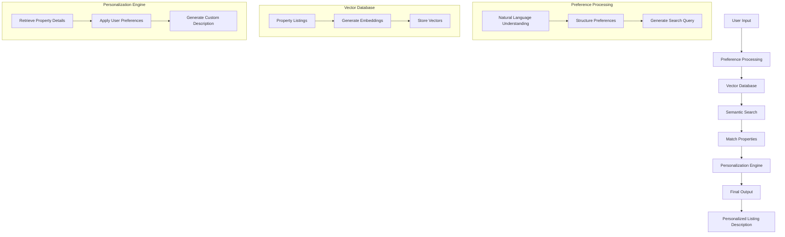

# HomeMatch - Personalized Real Estate Listings

## Project Introduction
Imagine you're a talented developer at "Future Homes Realty", a forward-thinking real estate company. In an industry where personalization is key to customer satisfaction, your company wants to revolutionize how clients interact with real estate listings. The goal is to create a personalized experience for each buyer, making the property search process more engaging and tailored to individual preferences.

## The Challenge
Your task is to develop an innovative application named "HomeMatch". This application leverages large language models (LLMs) and vector databases to transform standard real estate listings into personalized narratives that resonate with potential buyers' unique preferences and needs.

## Core Components
### 1. Understanding Buyer Preferences
- Buyers input requirements and preferences (location, property type, budget, amenities, lifestyle choices)
- LLMs interpret natural language inputs beyond basic filters

### 2. Integrating with Vector Database
- Property listings stored in vector database
- Vector embeddings match properties with buyer preferences
- Focus on neighborhood vibes, architectural styles, and amenity proximity

### 3. Personalized Listing Description Generation
- LLM rewrites descriptions highlighting buyer-relevant aspects
- Maintains factual accuracy while personalizing content

### 4. Listing Presentation
- Outputs personalized listing descriptions as text

---

## System Flow Diagram



## Project Implementation Guide

### Step 1: Setting Up the Python Application
- Initialize Python project with virtual environment
- Install required packages:
  - LangChain
  - LLM library (e.g., OpenAI's GPT)
  - Vector database (e.g., ChromaDB or LanceDB)

### Step 2: Generating Real Estate Listings
- Generate minimum 10 listings using LLM
- Example listing format:
  ```
  Neighborhood: Green Oaks
  Price: $800,000
  Bedrooms: 3
  Bathrooms: 2
  House Size: 2,000 sqft

  Description: Welcome to this eco-friendly oasis nestled in the heart of Green Oaks. This charming 3-bedroom, 2-bathroom home boasts energy-efficient features such as solar panels and a well-insulated structure. Natural light floods the living spaces, highlighting the beautiful hardwood floors and eco-conscious finishes. The open-concept kitchen and dining area lead to a spacious backyard with a vegetable garden, perfect for the eco-conscious family. Embrace sustainable living without compromising on style in this Green Oaks gem.

  Neighborhood Description: Green Oaks is a close-knit, environmentally-conscious community with access to organic grocery stores, community gardens, and bike paths. Take a stroll through the nearby Green Oaks Park or grab a cup of coffee at the cozy Green Bean Cafe. With easy access to public transportation and bike lanes, commuting is a breeze.
  ```

### Step 3: Vector Database Implementation
1. Set up ChromaDB or similar vector database
2. Convert listings to embeddings
3. Store embeddings in database

### Step 4: User Preference Interface
- Collect buyer preferences through:
  - Predefined questions
  - Natural language input
- Example questions:
  ```python
  questions = [
      "How big do you want your house to be?",
      "What are 3 most important things for you in choosing this property?",
      "Which amenities would you like?",
      "Which transportation options are important to you?",
      "How urban do you want your neighborhood to be?"
  ]
  ```

### Step 5: Search Implementation
- Implement semantic search using buyer preferences
- Fine-tune retrieval algorithm for optimal matching

### Step 6: Description Personalization
- Use LLM to customize descriptions
- Maintain factual accuracy
- Emphasize buyer-relevant features

### Step 7: Testing and Deliverables
- Test against project rubric
- Verify functionality with different buyer preferences
- Ensure code documentation
- Include example outputs

### Step 8: Project Submission Requirements
1. Generated listings file (named "listings")
2. Project documentation
3. Complete code submission

## Stand-Out Enhancement
Consider adding:
- Image search capability using CLIP
- Multi-modal search implementation

---
*Note: This project is part of the GenAI NanoDegree program at Future Homes Realty.*