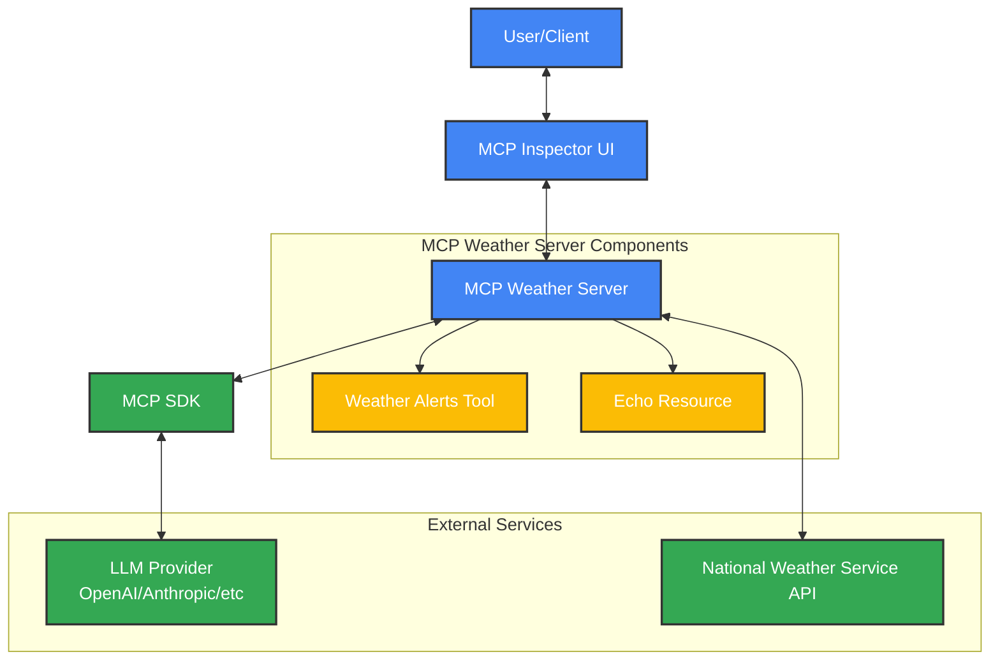
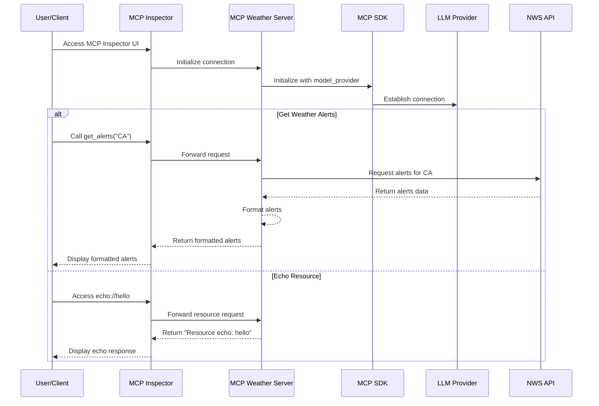
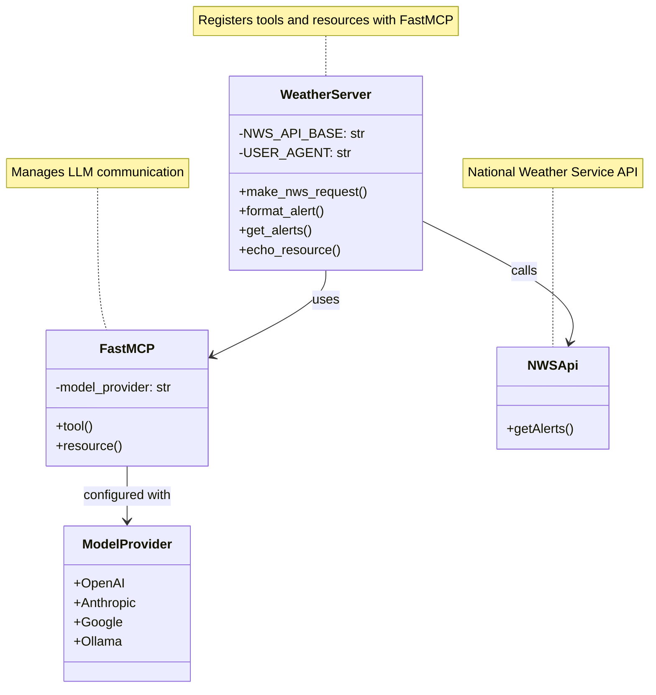
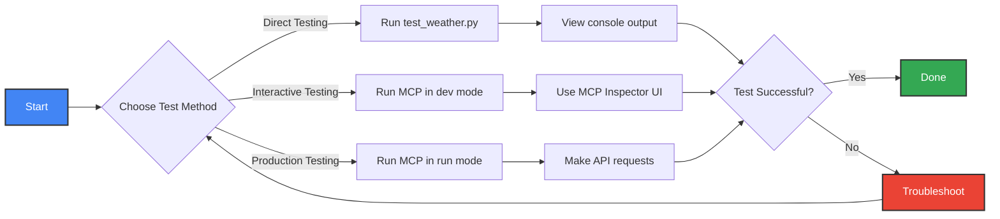

# Agentic AI Crash Course With Python

This repository contains code that follows along with the tutorial [Agentic AI Crash Course With Python](https://www.youtube.com/watch?v=MDBG2MOp4Go) on YouTube.

## Overview

This project demonstrates the implementation of agentic AI concepts using Python, following the techniques and patterns shown in the tutorial.

### Architecture Diagram



### Data Flow Diagram



### Component Diagram



## Important Links

- [MCP Python SDK GitHub Repository](https://github.com/modelcontextprotocol/python-sdk) - The official Python SDK for the Model Context Protocol
- [YouTube Tutorial](https://www.youtube.com/watch?v=MDBG2MOp4Go) - Agentic AI Crash Course With Python

## Project Structure

```
MCP_Agentic_AI_Crash_Course_With_Python/
├── .env.example         # Example environment variables file
├── .gitignore           # Git ignore file
├── .python-version      # Python version specification
├── .venv/               # Virtual environment (not tracked in git)
├── .windsurfrules       # Project configuration for deployment
├── README.md            # This file
├── main.py              # Main entry point for the application
├── pyproject.toml       # Project configuration and dependencies
├── requirements.txt     # Explicit dependencies for pip
├── test_weather.py      # Test script for weather alerts functionality
└── server/              # MCP server implementations
    └── weather.py       # Weather alerts MCP server
```

## Getting Started

This section will guide you through setting up your development environment and verifying that everything is working correctly.

### Prerequisites

- Python 3.13
- [uv](https://github.com/astral-sh/uv) - A fast Python package installer and resolver

### Step 1: Clone the Repository

```bash
git clone <repository-url>
cd MCP_Agentic_AI_Crash_Course_With_Python
```

### Step 2: Set Up the Environment

1. Install uv (if not already installed):
   ```bash
   brew install uv
   ```

2. Create a virtual environment with Python 3.13:
   ```bash
   uv venv -p python3.13 .venv
   source .venv/bin/activate
   ```

3. Install dependencies (choose one of the following methods):
   
   a. Using requirements.txt:
   ```bash
   uv pip install -r requirements.txt
   ```
   
   b. Using pyproject.toml (installs in development mode):
   ```bash
   uv pip install -e .
   ```

### Step 3: Configure API Keys

Create a `.env` file in the project root based on the example:

```bash
cp .env.example .env
```

Then edit the `.env` file to add your API keys:

```
OPENAI_API_KEY=your_actual_api_key_here
MODEL_PROVIDER=openai
```

### Step 4: Verify Your Setup

Run the main application to verify that your environment is set up correctly:

```bash
python main.py
```

You should see the following output, which indicates that everything is working properly:

```
MCP Agentic AI Crash Course
---------------------------
Starting application...
```

## Running the MCP Server

This project includes MCP (Model Context Protocol) servers that demonstrate agentic AI capabilities. Here are the different ways to run them:

### Development Mode

Development mode starts the MCP server with a web-based inspector UI for testing and debugging:

```bash
uv run mcp dev server/weather.py
```

This will start the MCP Inspector at http://127.0.0.1:6274, where you can:
- Test tools and resources interactively
- View request/response logs
- Debug your MCP server implementation

### Production Mode

To run the MCP server in production mode (without the inspector):

```bash
uv run mcp run server/weather.py
```

This starts the server without the inspector UI, suitable for production environments.

### Installing the MCP Server

To install the MCP server for use with other applications:

```bash
uv run mcp install server/weather.py
```

This registers the MCP server with the MCP CLI, making it available to other applications.

### Running with Different Model Providers

The MCP server is configured to use OpenAI by default, but you can change the model provider by:

1. Updating the `MODEL_PROVIDER` in your `.env` file:
   ```
   MODEL_PROVIDER=anthropic  # or another supported provider
   ```

2. Or specifying it directly when running the server:
   ```bash
   MODEL_PROVIDER=anthropic uv run mcp dev server/weather.py
   ```

Supported providers include:
- openai
- anthropic
- google
- ollama
- and others supported by the MCP SDK

## Testing

This project includes several ways to test the MCP weather server functionality:

### Testing Workflow



### Direct Testing with test_weather.py

The `test_weather.py` script provides a simple way to test the weather alerts functionality directly, without going through the MCP Inspector or API endpoints:

```bash
# Activate the virtual environment if not already activated
source .venv/bin/activate

# Run the test script
python test_weather.py
```

This script:
- Directly imports and calls the `get_alerts` function from the weather module
- Tests weather alerts for California (CA) and New York (NY)
- Prints the results to the console, showing any active weather alerts

This is useful for:
- Verifying that the core functionality works correctly
- Debugging issues with the weather alerts API
- Testing without needing to start the MCP server

### Testing with MCP Inspector

When running the server in development mode:

```bash
uv run mcp dev server/weather.py
```

You can test the tools and resources using the MCP Inspector at http://127.0.0.1:6274:

1. Open the MCP Inspector in your browser
2. In the "Tools" section, find the `get_alerts` tool
3. Enter a two-letter state code (e.g., "CA", "NY", "TX") in the input field
4. Click "Run" to execute the tool and see the results

You can also test the echo resource by entering a URL in the format `echo://your-message-here`.

### Testing in Production Mode

When running the server in production mode:

```bash
uv run mcp run server/weather.py
```

The server exposes the same functionality but without the inspector UI. You can test it programmatically by making HTTP requests to the appropriate endpoints.

### Troubleshooting Tests

If you encounter issues when testing:

1. **API Connection Issues**: Verify that your internet connection is working and that you can access the National Weather Service API (https://api.weather.gov)
2. **No Alerts Found**: Some states may not have active weather alerts at the time of testing
3. **Error Messages**: Check the console output for detailed error messages that can help identify the issue

## Features

- Weather alerts tool for retrieving active weather alerts by state
- Echo resource for testing resource functionality
- Configurable model provider support

## Troubleshooting

### Port Already in Use

If you see an error like `Proxy Server PORT IS IN USE at port 6277` or `Error POSTing to endpoint (HTTP 500): SSE connection not established`, it means there's already an MCP server running that's using the required port.

To fix this:

1. Kill any existing MCP processes:
   ```bash
   pkill -f "mcp"
   ```

2. Then try running the server again:
   ```bash
   uv run mcp dev server/weather.py
   ```

### API Key Issues

If you encounter authentication errors:

1. Verify your API key is correctly set in the `.env` file
2. Make sure the API key is valid and has the necessary permissions
3. Check that you've specified the correct model provider for your API key

### Connection Issues

If the MCP Inspector doesn't load or shows connection errors:

1. Make sure your browser can access `http://127.0.0.1:6274`
2. Check if any firewall or security software is blocking the connection
3. Try restarting the MCP server with the debug flag:
   ```bash
   MCP_DEBUG=1 uv run mcp dev server/weather.py
   ```

## Dependencies

This project relies on the following key dependencies:

- **mcp[cli]** - Model Context Protocol library and CLI tools, which provides a standardized way for applications to provide context to LLMs, separating the model from the context.

- **python-dotenv** - Loads environment variables from a `.env` file, making it easy to manage API keys and other configuration settings securely.

- **langchain** - A framework for developing applications powered by language models, providing abstractions for working with various LLMs.

- **langchain-community** - Community-contributed components for LangChain, including integrations with various tools and services.

- **langchain-core** - Core components of the LangChain framework, providing essential functionality for building LLM applications.

- **pydantic** - Data validation and settings management library, used for creating strongly typed data models and validating data structures.

- **httpx** - A fully featured HTTP client for Python 3, which includes support for HTTP/2, async APIs, and more.

## License

[License information will go here]